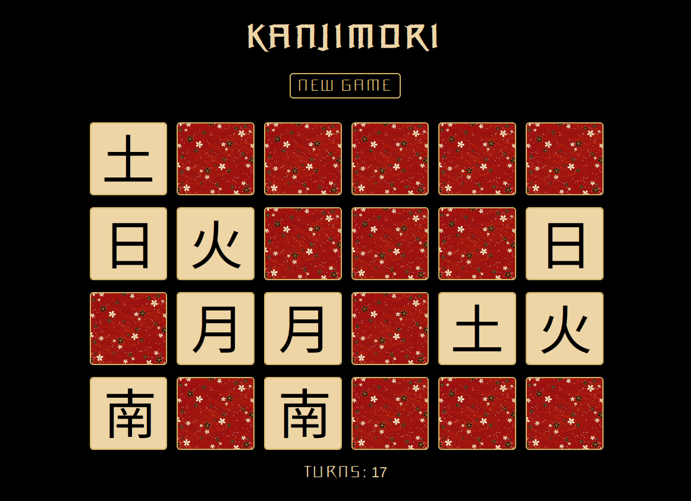

## Description

This application is a Japanese kanji memory game designed to help users learn and memorize Japanese characters while having fun

## Scripts

*Before these commands can be run, Node.js and NPM need to be installed on the local machine*

* `npm install`

The necessary dependencies can be installed by running `npm install` from the project directory.

This will install all the packages specified in the package.json file.

* `npm start`

The app can be started in development mode by running `npm start` from the project directory.

Open [http://localhost:3000](http://localhost:3000) to view it in the browser.

## Licences

* Fonts:

Designed by Felix Braden, Floodfonts Licence

* Cards cover:

Pixabay Licence
